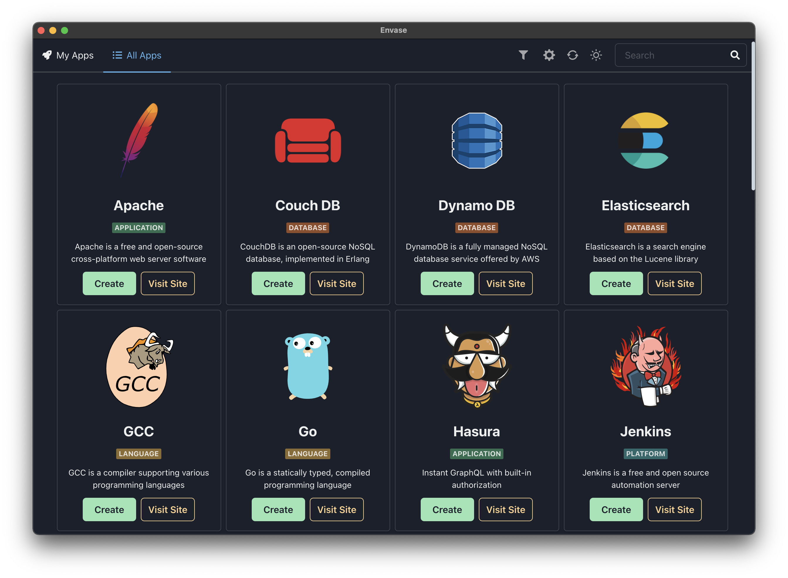

<h1 align="center">Envase</h1>

  
  
  

Envase removes the pain 😢 of running apps using docker by providing an amazing developer experience and an one stop shop app store for almost all popular applications. Stop breaking your heads with docker commands and start envasing 🎉

 

### Installation

1. You need to download and install docker if you don't have it already from [docker.com](https://www.docker.com/products/docker-desktop)
2. Now download and install the prebuilt envase binaries for windows, linux and mac from [the website](https://getenvase.com)

Show your support by 🌟 the repo

### Thanks 🙏

[Container Crane Icon](https://iconscout.com/icons/container-crane) by [Vichanon Chaimsuk](https://iconscout.com/contributors/ferdizzimo)

### License

GPL3 © [Ameer Jhan](mailto:ameerjhanprof@gmail.com)
